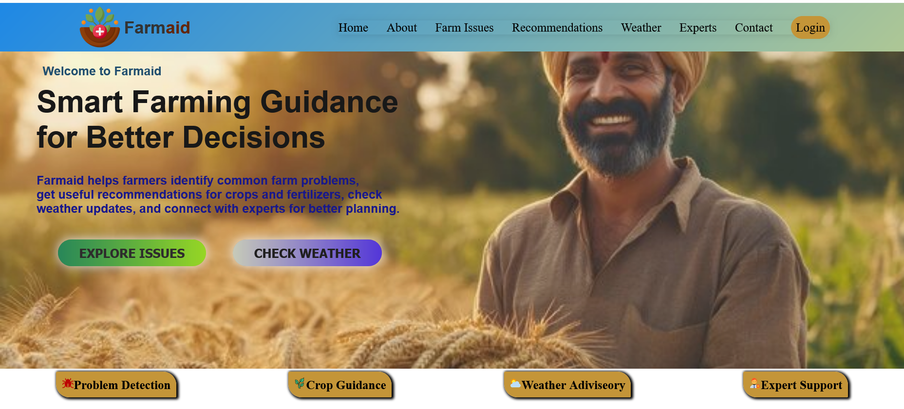
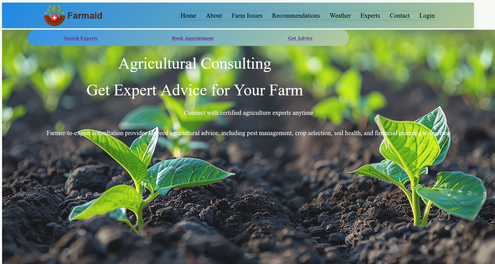

# 🌾 FarmAid

## 📸 Website Preview

A simple and responsive website that helps farmers with  
<b>crop recommendations, farm issue detection and expert advice</b>.  
Built using <b>HTML, CSS and JavaScript</b>.

---

## 🌐 Live Demo

🔗 https://vishakhamokate13.github.io/html-css-group-project-2-farmaid/

---

## 📸 Website Preview

---

## 🌱 Features Sections

| Feature | Image |
|--------|------|
| Farm Issues |  |
| Expert Advice |  |

---

## 📌 Features

✨ Crop recommendation system  
🐛 Farm issue detection UI  
👨‍🌾 Expert advice section  
📱 Fully responsive design  
🧭 Easy navigation  
⚡ Fast static website  

---

## 🛠️ Tech Stack

- HTML5  
- CSS3  
  

---

## ▶️ How to Run

Open **index.html** in your browser.

---

## 🤝 Contributors

---

## ⭐ Support

If you like this project, give it a ⭐ on GitHub.

---

## 📜 License

This project is open source and free to use.